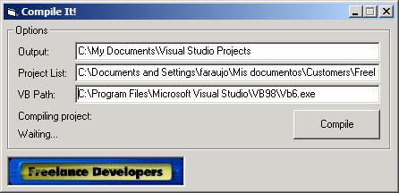



## Compile It\!

### Description

A small utility to compile a list of visual basic project with a specific output path
 
### More Info
 
A ProjectList.txt file should reside in application folder containing a project list with full path

             |
---                |---
**Submitted On**   |2003-09-04 16:38:50
**By**             |[Francisco Araujo](https://github.com/Planet-Source-Code/PSCIndex/blob/master/ByAuthor/francisco-araujo.md)
**Level**          |Intermediate
**User Rating**    |5.0 (10 globes from 2 users)
**Compatibility**  |VB 6\.0
**Category**       |[VB function enhancement](https://github.com/Planet-Source-Code/PSCIndex/blob/master/ByCategory/vb-function-enhancement__1-25.md)
**World**          |[Visual Basic](https://github.com/Planet-Source-Code/PSCIndex/blob/master/ByWorld/visual-basic.md)
**Archive File**   |[Compile\_It164109942003\.zip](https://github.com/Planet-Source-Code/francisco-araujo-compile-it__1-48261/archive/master.zip)

